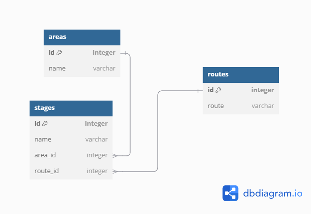

# SAKA STAGE MANAGEMENT SYSTEM

Allows users to manage a system that provides information regarding matatu transport to the general public. This solves the problem most people have when it comes to manoeuvering through this common means of transport in the country.

## Key Features

- Allows users to view all areas with operating matatu routes within Nairobi.
- Allows users to view matatu routes within Nairobi.
- Allows users to view all matatu stages within a specified area.
- Allows users to view all matatu stages functioning in a specified route.
- Allows users to add and/or remove a stage.
- Allows users to create a new matatu route.
- Allows users to add a new area with operating matatu routes.

## ERD Diagram



## Installation

Fork and clone this repository then run:

```
pipenv install
pipenv shell
```
to install dependencies required and create a virtual environment.

## Set-up

After installation, open your preferred terminal and run:

```
python lib/cli.py
```

## Technologies applied

- Python
- SQLite